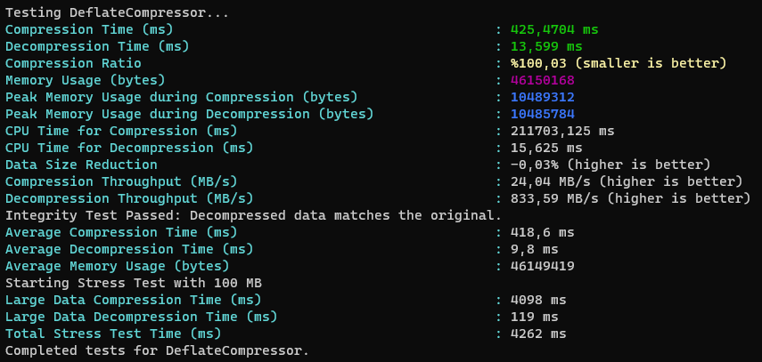
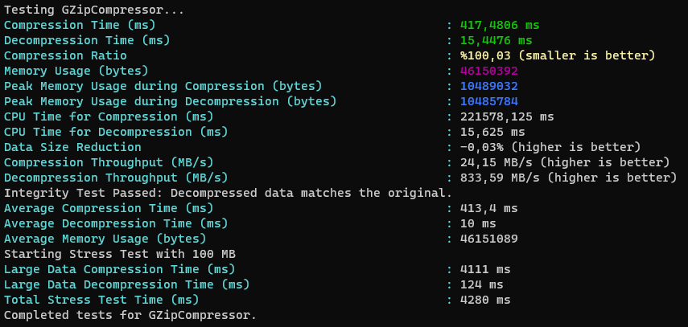
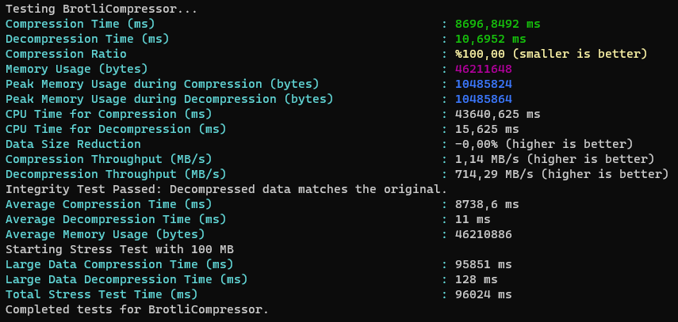

# Compression Performance Tester

## Overview
Compression Performance Tester is a C# application designed to evaluate and compare the performance of various compression algorithms. This tool allows users to test different aspects of compression algorithms such as time efficiency, compression ratio, memory usage, CPU load, and data integrity.

## Algorithms
This application currently supports the following compression algorithms:
- **Brotli**: A modern, lossless compression algorithm known for its efficiency in compressing web content. It provides high compression ratios and fast decompression speeds, making it ideal for web applications.
- **GZip**: A widely used compression method that balances compression ratio and speed. It is compatible with a broad range of platforms and applications, making it one of the most versatile compression algorithms.
- **Deflate**: An algorithm used in various compression formats including GZip and ZIP. Deflate offers a good balance between compression speed and efficiency, and it's widely supported across different platforms.

## Test Results

The table below compares various performance metrics for the Brotli, GZip, and Deflate algorithms.

|    Test   | Deflate   | GZip     | Brotli    |
|-----------|-----------|----------|-----------|
| Compression Time (ms)       | 410,70    | 405,59   | 10584,17  |
| Decompression Time (ms)     | 12,67     | 14,30     | 13,7     |
| Large Data Compression Time (ms) | 4118  | 3943     | 98260  |
| Large Data Decompression Time (ms) | 120 | 127 | 159 |
| Total Stress Test Time (ms) | 4286 | 4114 | 98465 |
| CPU Time for Compression (ms)| 97859,37   | 102109,37  | 39265,52 |
| CPU Time for Decompression (ms)| 15,62   | 15,62  | 15,62 |
| Memory Usage (bytes)        | 45177576  | 45177624  | 45173632  |
| Peak Memory Usage during Compression | 10003080  | 10003096  | 10000056  |
| Peak Memory Usage during Decompression | 10000024  | 10000024  | 10000024  |
| Avg. Compression Time over 5 runs (ms) | 409,6 | 410,2 | 9487 |
| Avg. Decompression Time over 5 runs (ms) | 10,8 | 10,4 | 12,8 |
| Avg. Memory Usage over 5 runs (bytes) | 45178344 | 45178584 | 45173908 |
| Compression Throughput | 23,84 MB/s | 23,66 MB/s | 0,92 MB/s |
| Decompression Throughput | 280,58 MB/s | 414,77 MB/s | 366,80 MB/s |

*Note: All tests were conducted on 10 MB of data. Large Data: 100 MB*

## Performance Analysis of Compression Algorithms

***NOTE:** This section was prepared by ChatGPT 4 based on test results.*

The table compares the performance of Deflate, GZip, and Brotli compression algorithms across various metrics. Here's an interpretation of the results:

### 1. **Compression Time (ms):**
- **For Small Data Set:** Deflate and GZip offer similar compression times, while Brotli takes significantly longer. This might indicate that Brotli uses more complex algorithms to achieve higher compression ratios.
- **For Large Data Set (Stress Test):** A similar trend is observed for large data sets, with Brotli taking much longer to compress.

### 2. **Decompression Time (ms):**
- Decompression times for all algorithms are relatively similar, indicating comparable efficiency in this aspect.

### 3. **CPU Time for Compression/Decompression (ms):**
- Brotli uses significantly less CPU time for compression compared to the others, which may indicate higher efficiency. However, this is offset by longer compression times.
- CPU times for decompression are similar across all algorithms, suggesting a comparable resource usage for this operation.

### 4. **Memory Usage:**
- All algorithms utilize a similar amount of memory. However, peak memory usage during compression and decompression might vary.

### 5. **Throughput:**
- **Compression:** Brotli's throughput efficiency (in MB/s) is significantly lower, indicating slower performance.
- **Decompression:** For decompression efficiency, Brotli offers competitive values compared to the others.

### Overall Assessment:
- **Deflate and GZip:** These algorithms show similar performance and are generally faster in terms of compression and decompression times but may use more CPU time compared to Brotli.
- **Brotli:** It might offer better compression ratios (not directly shown in the table but implied by longer compression times) but requires significantly more time for compression. It's more efficient in terms of CPU usage.

### Conclusion:
Each algorithm has its pros and cons. The best choice will depend on your specific needs and the requirements of your application:
- **Looking for speed?** Deflate or GZip might be more suitable.
- **Want to reduce CPU usage?** Brotli could be a better option.
- **Seeking the best compression ratio?** Brotli may be more effective but at the cost of longer compression times.

## Application Screenshots

### Deflate

### Gzip

### Brotli

## Features

- **Compression Time**: Measures the time taken to compress the test data.
- **Decompression Time**: Measures the time taken to decompress the test data.
- **Compression Ratio**: Calculates the ratio of the compressed data size to the original data size.
- **Data Size Reduction**: Determines the percentage reduction in data size after compression.
- **Memory Usage**: Measures the amount of memory used during the compression and decompression processes.
- **CPU Load for Compression**: Measures the CPU time consumed during the compression process.
- **CPU Load for Decompression**: Measures the CPU time consumed during the decompression process.
- **Data Integrity**: Checks whether the decompressed data matches the original data.
- **Throughput Rate**: Calculates the rate of data processing during compression and decompression in MB/s.
- **Multiple Runs**: Repeats the tests a specified number of times to ensure consistency and reliability of results.

## How to Use
1. Clone the repository to your local machine.
2. Ensure you have the necessary .NET environment to run C# applications.
3. Install required dependencies for the compression algorithms you wish to test.
4. Run the application and choose the compression algorithm and test parameters.
5. View and analyze the test results.

## Contributing
Contributions to add more features, tests, or support for additional compression algorithms are welcome. Please feel free to fork the repository and submit your pull requests.